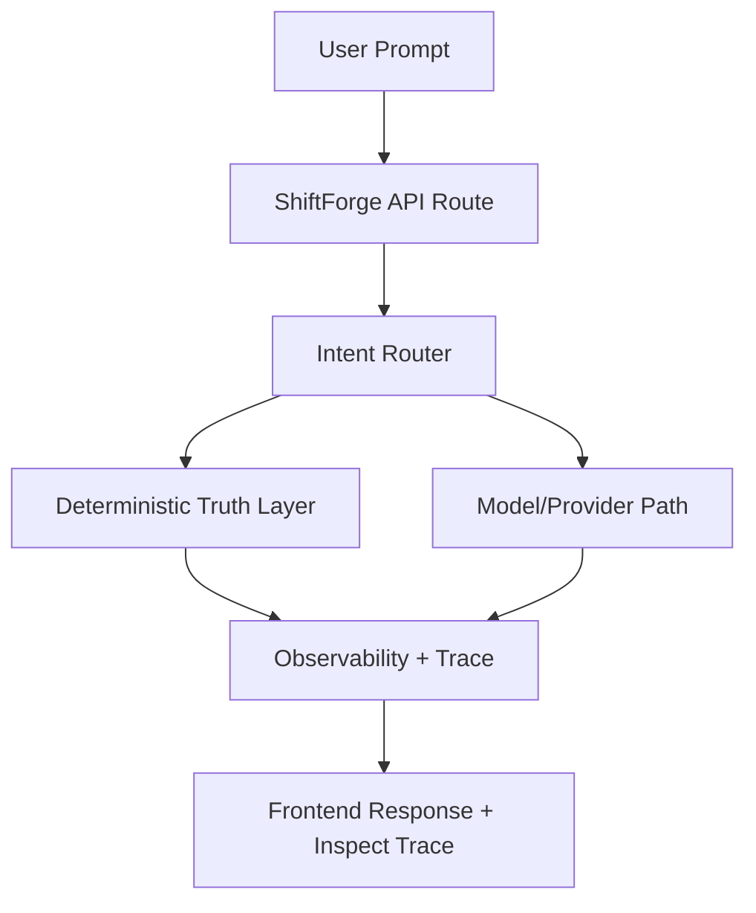

# Showcase ShiftForge

This repository is a curated public slice of ShiftForge.

It does **not** mirror the private production tree.

It shows:

- verified live backend behavior
- selected backend modules that explain how ShiftForge currently works
- the boundary between **implemented now** and **intended next**

## Verified Live Now

Verified on 2026-06-15 from the live server:

- active provider: `ollama`
- active model: `qwen2.5-coder:3b`
- deterministic runtime-truth answers for identity/runtime questions
- structured trace/observability pipeline with trace ids
- safe MCP/provider introspection without exposing secrets
- MCP runtime governance and path-repair behavior

See:

- [docs/live-now.md](docs/live-now.md)
- [evidence/health-2026-06-15.json](evidence/health-2026-06-15.json)
- [evidence/identity-response-2026-06-15.ndjson](evidence/identity-response-2026-06-15.ndjson)

## Included Public Backend Modules

- [showcase/backend/core/reality/prompt_metabolism.py](showcase/backend/core/reality/prompt_metabolism.py)
- [showcase/backend/core/sil/observability.py](showcase/backend/core/sil/observability.py)
- [showcase/backend/core/mcp_provider_introspection.py](showcase/backend/core/mcp_provider_introspection.py)

These files were selected because they explain real product behavior without exposing private keys, private auth data, or the full internal sync/evolution surface.

## Architecture Snapshot

## Implemented vs Intended

- [Implemented now](docs/live-now.md)
- [Intended direction](docs/intended-direction.md)
- [Public scope and exclusions](docs/public-scope.md)

## Important Boundary

Not every module in the private ShiftForge tree is live.

This showcase intentionally avoids publishing:

- private deployment internals
- private auth/session material
- raw provider keys or env files
- internal evolution/sync code that is not suitable for public release
- dormant modules that are not yet authoritative in production
